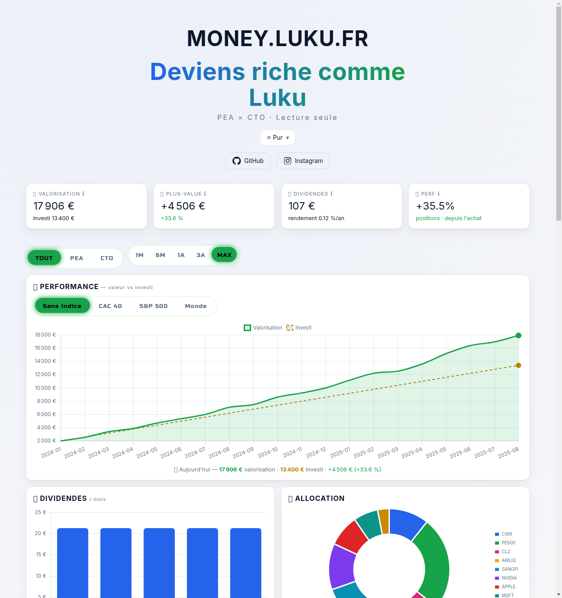
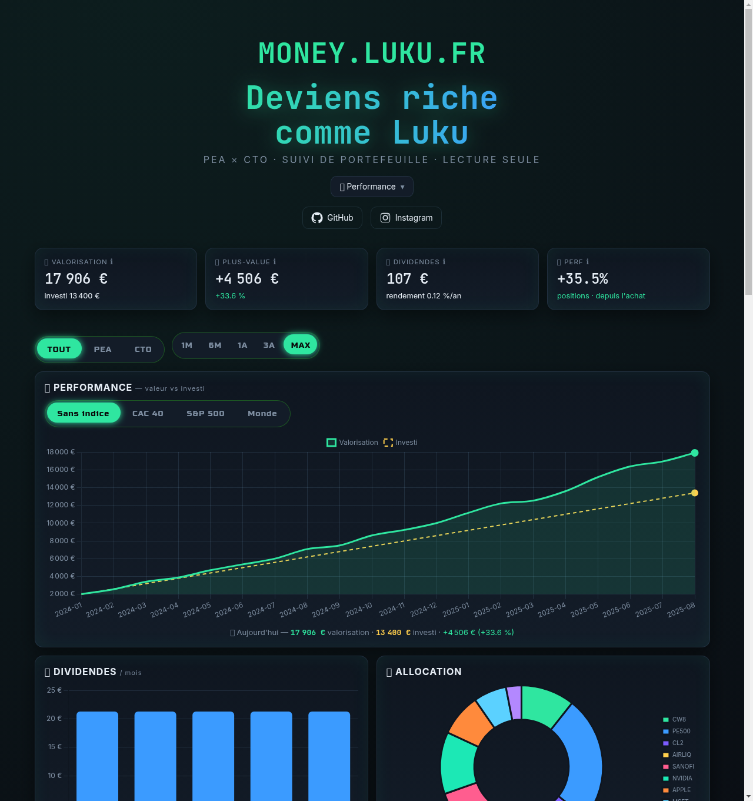
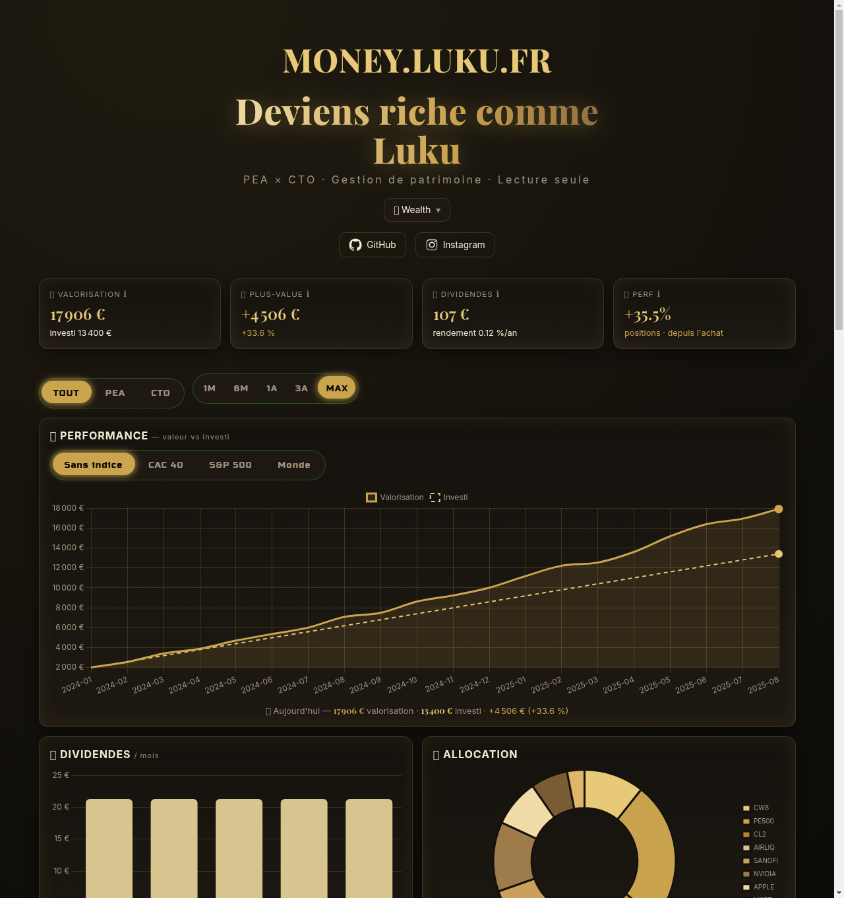
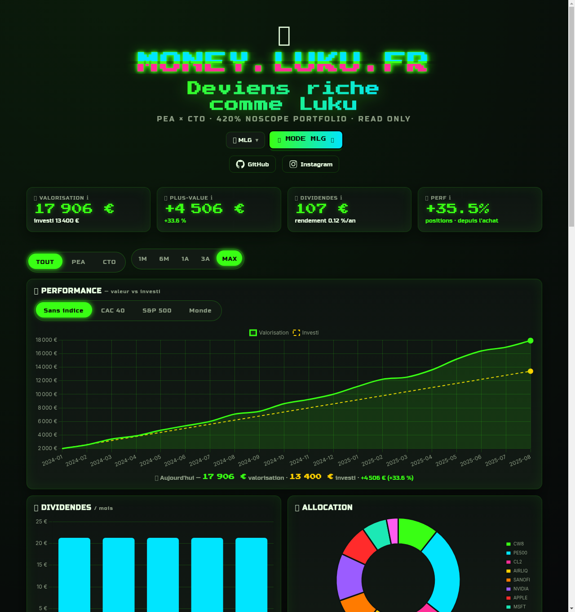

<div align="center">

# 💸 money.luku.fr

### Deviens riche comme Luku.

**Dashboard d'investissement boursier perso (PEA + CTO)** — auto-hébergé, *read-only*, 4 thèmes, et carrément trop stylé.

[](https://www.chartjs.org/)
[](#)
[](#)
[](#-4-thèmes)
[](#-vie-privée)



</div>

---

## ✨ C'est quoi ?

Un tableau de bord façon **Finary**, mais **fait main et 100 % à moi** : il agrège mon **PEA** (Bourse Direct) et mon **CTO** (Trade Republic), trace ma performance réelle, mes dividendes, mon allocation, et projette mon patrimoine futur. Le tout en site **statique** (zéro base de données), servi par nginx derrière Traefik, et **rafraîchi tout seul** chaque jour.

> ⚠️ Les **données affichées dans les captures sont fictives**. Mes vraies données financières ne sont **jamais** commitées (voir [Vie privée](#-vie-privée)).

---

## 🎨 4 thèmes

Un sélecteur en haut de page, mémorisé entre les visites. Chaque thème change palette, polices **et** couleurs des graphiques.

| ⚪ Pur — minimal façon Apple | 📈 Performance — terminal trading |
|:---:|:---:|
|  |  |
| 💎 **Wealth — luxe or sur noir** | 🎮 **MLG — montage parody 2013** |
|  |  |

---

## 🚀 Fonctionnalités

- 📊 **Courbe de performance** — valeur de marché vs apports investis, reconstruite mois par mois à partir des cours historiques.
- 🎯 **KPIs** — valorisation, plus-value, dividendes encaissés, **perf des positions depuis l'achat** (avec tooltips explicatifs).
- 🥧 **Allocation** par ligne + **répartition par pays** 🌍 et par **secteur** 🏷️ (barres animées).
- 🤑 **Dividendes** — historique mensuel, **rendement annuel**, et **calendrier prévisionnel** des 12 prochains mois (filtré sur les lignes encore détenues).
- 🔮 **Prévisionnel** — projection par scénarios à rendement réglable, **dividendes réinvestis** et **effet de levier pondéré** par la composition réelle, en euros constants en option.
- 📈 **Comparaison vs indices** — « et si j'avais investi mes apports sur le **S&P 500 / CAC 40 / MSCI World** ? » (simulation DCA).
- ⏱️ **Filtre temporel** 1M / 6M / 1A / 3A / Max, table de positions **triable**.
- 📱 **PWA installable** + **responsive** mobile / tablette (iOS & Android).
- 🔒 **Read-only** : nginx bloque toute méthode ≠ GET/HEAD.

---

## 🛠️ Stack

| | |
|---|---|
| **Front** | HTML / CSS / **vanilla JS**, [Chart.js 4](https://www.chartjs.org/), animations [transitions.dev](https://transitions.dev) (number pop-in, tabs, tooltip, dropdown…) |
| **Serveur** | nginx statique derrière **Traefik** (SSL Let's Encrypt auto) |
| **Données** | scripts **Python** (stdlib) — aucun framework, aucune DB |
| **Cours** | Yahoo Finance (cours actuels + historique, conversion FX) |
| **Auto** | `cron` : news chaque heure, cours + portefeuilles + reconstruction chaque jour |

---

## 🔌 Sources de données

| Compte | Source | Récupération |
|---|---|---|
| **PEA** | Bourse Direct — avis d'opéré CSV | positions, PRU (coût moyen), dividendes, apports |
| **CTO** | Trade Republic — API WebSocket `compactPortfolioByTypeV2` | positions, parts & PRU exacts, dividendes, apports |

Tout est converti en un seul fichier **`data.json`** qui pilote le dashboard.

---

## 🏃 Lancer en local

```bash
git clone https://github.com/LukuLaMule/money-dashboard.git
cd money-dashboard
cp html/data.example.json html/data.json   # remplis-le, ou génère-le via tools/
docker compose up -d                         # → http://localhost
```

Le dashboard lit `html/data.json`. Le format est documenté dans `html/data.example.json`.

---

## 🔒 Vie privée

Ce dépôt est **public mais ne contient aucune donnée financière réelle**. Sont **gitignorés** :
`html/data.json`, `tools/prices.json`, `tools/price_history.json`, `tools/cto_positions.json`, `tools/sources/`…
Seuls le **code** et des **exemples anonymisés** sont publiés. Les captures ci-dessus utilisent un jeu de données **fictif**.

---

## 📜 Disclaimer

Projet **personnel**, à but d'apprentissage. **Aucun conseil en investissement.** Les performances passées ne préjugent pas des performances futures.

---

<div align="center">

Fait avec 🔥 par **Luku** — [GitHub](https://github.com/LukuLaMule) · [Instagram](https://instagram.com/luku_la_mule)

⭐ *Si ça te plaît, lâche une étoile !*

</div>
